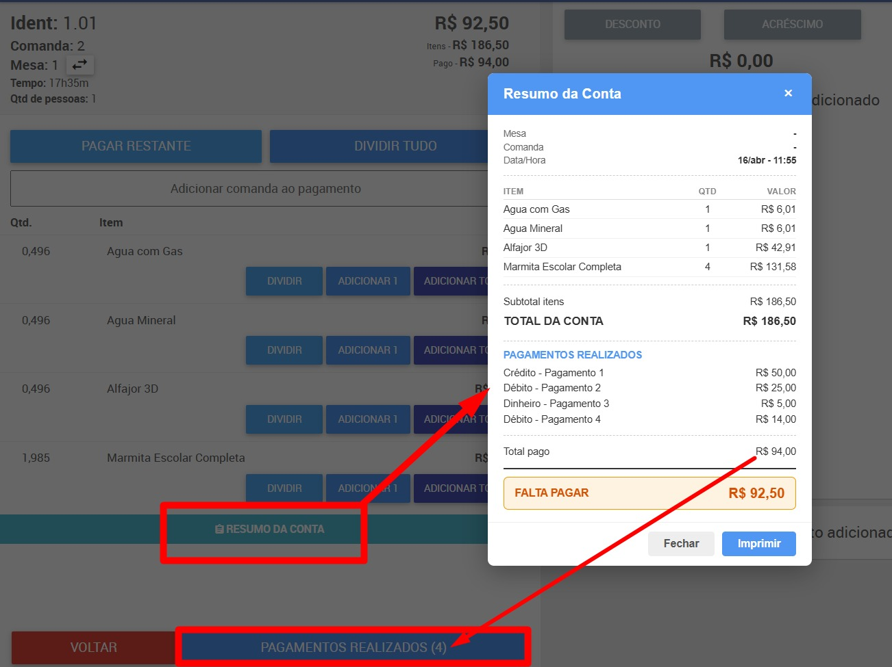

# Saipos Tools v6.52.1

Extensão para Google Chrome que adiciona funcionalidades extras ao painel [SAIPOS](https://conta.saipos.com): **Relatórios de Comissão**, **Relatório de Entregas**, **Happy Hour Automático**, **Resumo da Conta com Impressão**, **Importação de Produtos** e **Gestão de Estoque**.

---

## 📦 Como Instalar

1. Abra `chrome://extensions/` no Chrome
2. Ative o **Modo do desenvolvedor** (canto superior direito)
3. Clique em **"Carregar sem compactação"**
4. Selecione a pasta `Saipos Tools`
5. A extensão abre como **Side Panel** — clique no ícone na barra do Chrome

---

## 📊 1. Relatório de Comissão por Garçom

Extrai vendas via API, calcula comissões e gera relatório visual completo.

### Como usar:
1. Acesse https://conta.saipos.com → **Relatórios > Vendas por Período**
2. Escolha o período e aguarde a tabela carregar
3. Abra a extensão → aba **COMISSÕES** → clique **▶ INICIAR**
4. Aguarde a coleta (barra de progresso mostra o andamento)
5. Clique em **📄 RELATÓRIO** para abrir o relatório completo

### Filtros por tipo de atendimento:
- **Multi-select**: Entrega / Retirada / Salão / Ficha — selecione um ou mais
- Canceladas desmarcadas por padrão
- Quando somente **Entrega** selecionada, abre o Relatório de Entregas automaticamente

### O relatório inclui:
- Resumo por garçom (total vendido, comissão, qtd de itens)
- Detalhamento por venda (mesa, comanda, hora, itens, taxa de serviço)
- Identificação de itens isentos de taxa
- Alertas: vendas sem taxa, taxa < 10% (risco de burla), cancelamentos
- Exportação: **CSV de Itens**, **CSV de Garçons**, **CSV de Vendas**, **Copiar** e **Imprimir**

---

## 🚗 2. Relatório de Entregas

Relatório dedicado para pedidos de delivery, com identificação de entregador e canal de origem.

### Como usar:
1. Abra a extensão → aba **ENTREGA** → configure período
2. Clique **▶ INICIAR** — datas preenchidas automaticamente e navega no Saipos
3. Clique **📄 RELATÓRIO** para abrir

### Funcionalidades:
- **Entregador**: buscado individualmente via API (nome aparece como chip no relatório)
- **Canal**: badge iFood / 99food / Próprio
- **Filtro de parceiros**: oculta pedidos de parceiros específicos
- **Aba de filtros** no relatório com opções de exibição
- **Auto-fill de datas**: preenche o formulário do Saipos automaticamente ao iniciar

---

## 🍺 3. Happy Hour Automático

Troca o preço dos produtos automaticamente nos horários e dias configurados.

### Como configurar:
1. Abra a extensão → aba **HAPPY HOUR**
2. Preencha: nome exato do item, preço normal, preço promo
3. Selecione os dias da semana e horário de início/fim
4. Clique em **Salvar Promoção**

O preço altera automaticamente quando entra na janela de horário e volta ao normal quando sai.

- **✏️ Editar** / **🗑️ Deletar** promoções existentes
- **💾 Exportar** / **📥 Importar** backup em JSON
- **Persistência dupla**: dados salvos em `local` + `sync` — recupera automaticamente após reinstalação da extensão

---

## 🧾 4. Resumo da Conta (Impressão)

Botão **"Resumo"** injetado na tela de fechamento e edição de conta.

### Funcionalidades:
- Exibe modal com mesa, comanda, garçom, itens, quantidades e valores
- Lê pagamentos já realizados (pagamento parcial)
- Restaura valores originais (compensa o rateio proporcional do SAIPOS)
- Calcula saldo restante
- Gera arquivo `.saiposprt` com cabeçalho centralizado (loja, CNPJ, endereço)
- Leitura de mesa/comanda com 4 camadas de fallback (Angular scope, DOM data-qa, texto visível, API REST)

### Configurações de impressão:
- **Largura configurável**: 32 / 40 / 42 / 44 / 48 colunas (padrão: 42)
- **Tamanho de fonte**: ajuste em px — fonte compacta (Font B) ativa automaticamente quando ≤ 9px
- **Destaque visual**: Mesa, Comanda, Identificação e Falta a Pagar em negrito/tamanho ampliado

### Correções implementadas:
- **Botão voltar corrigido**: retorna à tela de edição em vez da tela principal
- **Sobreposição do botão de impressão nativo**: intercepta o botão original do SAIPOS (capture phase) — funciona também na tela de edição da comanda
- **Couvert não some**: flag `paymentWasCompleted` detecta POST para endpoints de pagamento e evita o redirect incorreto após fechamento da conta
- **Sem travamento ao finalizar conta**: chamadas assíncronas paralelizadas + timeouts reduzidos; fallback DOM usado apenas como último recurso
- **Pagamentos realizados sempre exibidos**: cadeia de fallback scope → API → DOM garante exibição mesmo quando Angular scope não está disponível
- **StoreId detectado automaticamente**: interceptor captura o ID da loja via XHR/fetch e persiste no `localStorage` para garantia mesmo se o evento disparar antes do script carregar



---

## 📋 5. Importar Produtos

Na aba **IMPORTAR PROD.** do painel, cole dados em formato CSV para importação em lote de produtos.

### Formato esperado:
```
nome,valor,categoria,descricao,pesado,taxa_servico
Brigadeiro,3.50,Doces,Sabores variados,N,S
```

- **Colunas**: nome, valor, categoria, descrição, pesado (S/N), taxa de serviço (S/N)
- Categorias são criadas automaticamente se não existirem na loja
- Clique em **Importar Lote** para processar
- **↩️ Desfazer Última Importação**: remove todos os produtos criados (com confirmação)

---

## 📦 6. Gestão de Estoque

Aba **ESTOQUE** protegida por senha para operações sensíveis no catálogo de produtos.

### Funcionalidades:
- **Catraca com senha**: acesso protegido (senha padrão: `314159`), com animação de cadeado
- **💾 Fazer Backup**: exporta todos os produtos do catálogo em JSON (inclui dados completos)
- **🗑️ Excluir Todos os Produtos**: remove todo o catálogo com log de progresso em tempo real
- Log de operações exibido na tela durante o processo

---

## 🔒 Controle de Abas (Lock)

O painel possui sistema de bloqueio por senha para restringir o acesso a abas específicas.

- Abas bloqueadas ficam **completamente ocultas** (não aparecem na barra de navegação)
- Ao bloquear a aba ativa, a extensão redireciona automaticamente para a primeira aba disponível
- Senha padrão: `314159`
- Configuração salva em `chrome.storage.local`
- Padrão: somente **Comissões** e **Happy Hour** visíveis — demais abas bloqueadas

---

## 📁 Estrutura do Projeto

```
Saipos Tools/
├── manifest.json
├── icons/             # Ícones da extensão
├── images/            # Screenshots para documentação
├── pages/             # HTMLs de interface
│   ├── popup.html
│   ├── report.html
│   └── delivery-report.html
└── src/
    ├── background.js  # Service worker
    ├── content/       # Scripts injetados no site
    │   ├── interceptor.js      # MAIN world — intercepta XHR/fetch, broadcast de eventos
    │   ├── content.js          # ISOLATED world — importação e gestão de produtos
    │   └── partial-payment.js  # ISOLATED world — Resumo da Conta e impressão
    ├── ui/            # Scripts de interface
    │   ├── popup.js
    │   └── report-page.js
    └── lib/           # Bibliotecas auxiliares
        ├── report.js
        └── delivery-report.js
```

---

## 🔒 Segurança

- Não solicita senhas ou credenciais externas
- Funciona apenas em `conta.saipos.com`
- Dados permanecem restritos à sua conta

---

## ⚠️ Aviso Legal

Esta extensão é uma ferramenta **auxiliar independente**, desenvolvida para suprir funcionalidades complementares que auxiliam na operação do PDV. **Não possui vínculo oficial** com a SAIPOS.

**SAIPOS** é uma marca registrada de seus respectivos proprietários. Todos os direitos sobre a plataforma, API, nome, logotipo e demais propriedades intelectuais são **reservados exclusivamente à SAIPOS e seus detentores**.

---

## ⚠️ Isenção de Responsabilidade

Este é um **projeto pessoal, sem fins lucrativos**, desenvolvido com o intuito de colaborar e auxiliar operadores que utilizam o sistema SAIPOS.

> **Atenção:** Não nos responsabilizamos por eventuais erros, divergências de valores ou inconsistências que a extensão possa gerar. **Sempre confira os valores cobrados** diretamente no sistema SAIPOS antes de finalizar qualquer operação. O uso desta ferramenta é de inteira responsabilidade do usuário.

---

_Saipos Tools v6.52.1 — Abril / 2026_
